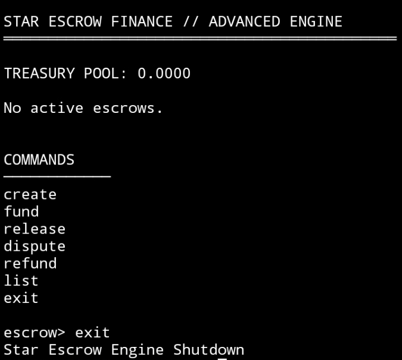

# ⭐ Star Escrow Finance  
### Advanced Escrow Lifecycle Engine

Star Escrow Finance is a CLI-based escrow transaction simulation engine built with lifecycle modeling, fee mechanics, and dispute resolution logic.

This advanced version extends the base escrow implementation with financial modeling and state-driven transaction control.

---

## 🚀 Core Features

- Unique Escrow ID generation (crypto-based)
- Treasury fee pool (0.5% per release)
- Escrow lifecycle state machine
- Dispute & refund flow
- Transaction hash simulation
- Timestamp tracking
- Structured CLI dashboard
- Multi-command execution interface

---

## 🔄 Escrow Lifecycle

CREATED  
→ FUNDED  
→ RELEASED  

OR

CREATED  
→ FUNDED  
→ DISPUTED  
→ REFUNDED  

Each escrow is immutable after final state.

---

## 💰 Fee System

Every successful release:

- 0.5% deducted as protocol fee
- Fee added to Treasury Pool
- Net amount released to seller

Treasury pool accumulates across transactions.

---

## 🧾 Transaction Hashing

Each escrow generates:

- SHA-256 hash
- Deterministic transaction signature
- Unique crypto-based ID

This simulates blockchain transaction identity behavior.

---

## 📊 Preview Dashboard

CLI execution preview:



Dashboard shows:

- Treasury Pool balance
- Escrow entries
- Lifecycle status
- Creation timestamp
- Transaction hash
- Structured command layout

---

## 🛠 Command List

create  
fund  
release  
dispute  
refund  
list  
exit  

---

## 📁 Project Structure

```
star-escrow-finance/
│
├── index.js
├── package.json
├── README.md
├── SKILL.md
└── proof/
    └── preview-dashboard.jpg
```

---

## 🧠 Architecture Overview

- Node.js ES Module
- Readline-based CLI interaction
- Crypto module for hashing
- State-driven escrow engine
- Fee & treasury modeling
- Deterministic state transitions

---

## 🔐 Governance & Financial Logic

The engine demonstrates:

- State machine modeling
- Controlled transaction lifecycle
- Fee-based protocol economics
- Dispute resolution logic
- Structured CLI financial dashboard

---

## 🏗 Installation

Clone repository:

```bash
git clone https://github.com/zkbintang/star-escrow-finance.git
cd star-escrow-finance
```

Install dependencies:

```bash
npm install
```

Run engine:

```bash
node index.js
```

---

## 🧩 Intercom Reference

This repository is a customized fork implementation extending the Intercom stack framework into an advanced escrow simulation engine.

---

## 📜 License

Open simulation license for educational and experimental financial modeling.

---

## 🔗 Trac Wallet

trac1d5azfwfju83h7djwj9v47uxjq9ynrlgpp0u97vukmgkg3x8emaqsy4ef6j

---

Star Escrow Finance  
Advanced Lifecycle • Fee Modeling • Escrow Simulation Engine
