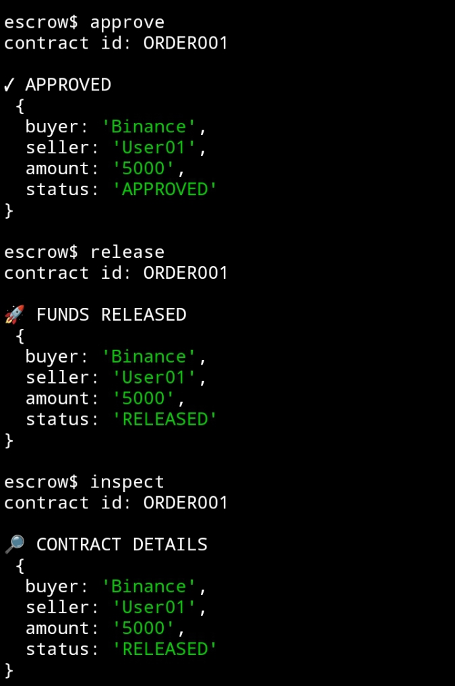
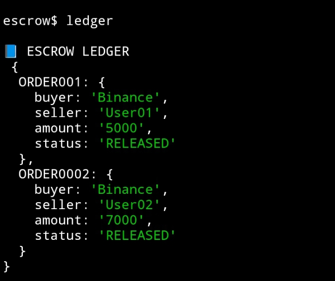

# ⭐ Star Escrow Finance

A CLI-based escrow lifecycle engine built on Intercom architecture.

Star Escrow Finance simulates structured peer-to-peer escrow agreements
with deterministic contract state transitions.

---

## 🚀 Features

- Escrow contract creation
- Approval workflow
- Controlled fund release
- Contract inspection
- Ledger overview
- Lightweight CLI engine

---

## ⚙️ Installation

```bash
git clone https://github.com/zkbintang/star-escrow-finance.git
cd star-escrow-finance/star-escrow
npm install
node index.js```

---

# 📸 Proof of Work

## ⭐ Agent Initialization


Escrow terminal successfully initialized and ready.

---

## 📄 Escrow Contract Creation


Contract ORDER001 created with buyer and seller details.

---

## ✅ Approval & Fund Release



Contract approved and funds released successfully.

---

## 📘 Ledger Verification



Ledger reflects updated contract state transitions.

---

### Execution Summary

- Engine initialized
- Escrow contract opened
- Contract approved
- Funds released
- Ledger verified
- No runtime errors detected

---

## 💰 Trac Address

trac1d5azfwfju83h7djwj9v47uxjq9ynrlgpp0u97vukmgkg3x8emaqsy4ef6j

---
